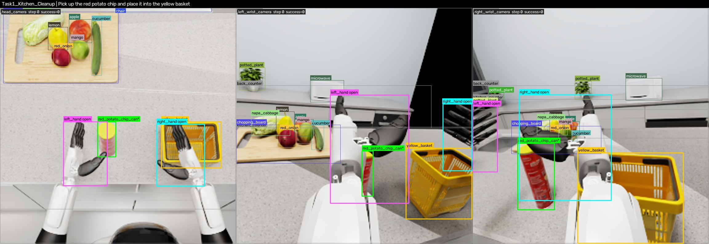

# RealMirror Trajectory Annotation

SmolVLA 평가 기록에 물체·양손·주변 환경의 2D/3D 주석을 생성합니다.
**5개 작업 · 1,500 에피소드 · 662,190 스텝 · 3개 카메라(256×256)**. 원본 RGB와 action은 별도 HDF5에 유지합니다.



Task1 · episode-000006 · step 0. 왼쪽부터 head / left_wrist / right_wrist. 물체·양손·주변 환경의 2D 박스를 표시합니다.

## Annotation 항목

| 대상 | 주석 |
|---|---|
| 작업 물체 (`objects`) | 이름·종류·역할, 위치·회전·속도, 3D 박스, 양손과 거리 |
| 양손 (`grippers`) | 손바닥·손목·손가락 위치, 관절각·닫힘 정도, 3D 박스 |
| 주변 환경 (`scene_objects`) | 보이는 식기·과일·가구·가전 등의 이름·종류, 정적 3D 박스, 양손과 거리 |
| 카메라별 정보 (`views`) | 2D 박스, 가시 영역 박스·마스크, 가시 픽셀 수, 깊이, 근사 가림 비율 |
| 공통 정보 | 작업 지시문, 성공 여부, 로봇 상태, 카메라 위치·회전 |

## 데이터셋 구조

```text
outputs/realmirror_smolvla/<Task>/<run>/episode-XXXXXX/
├── episode_meta.json       # 원본 경로, 작업·성공 여부, 카메라 설정, 물체 ID 목록
├── annotations.jsonl       # 한 줄 = 한 스텝 (세 카메라 포함)
├── masks.h5                # id_map[T, 3, 256, 256], uint16
└── review/step_XXXXXX.jpg   # 검토용 이미지 3장
```

### annotations.jsonl

주요 필드 구조입니다. 값은 예시이며 반복 필드와 일부 세부 필드는 생략했습니다.

```jsonc
{
  "step": 0,
  "instruction": "Pick up the red potato chip and place it into the yellow basket",
  "success": false,
  "cameras": {
    "head_camera": { "position_world": [0, 0.05, 1.4], "quat_wxyz_world": [0.819, 0, 0.574, 0] },
    "left_wrist_camera": {},                       // head와 동일한 필드
    "right_wrist_camera": {}
  },
  "robot": {
    "root_position": [0, 0, 0], "root_quat_wxyz": [1, 0, 0, 0],
    "joint_positions": [],                        // 50개 관절값
    "state26": []                                 // 26차원 상태
  },
  "grippers": {
    "left": {
      "mask_id": 60001,
      "palm_position_world": [0.3, 0.2, 1.0], "palm_quat_wxyz": [1, 0, 0, 0],
      "wrist_position_world": [0.3, 0.2, 1.1],
      "fingertips_world": { "thumb": [0.3, 0.2, 0.95] }, // index/middle/ring/little도 포함
      "finger_joint_angles_rad": {},
      "closure_ratio": 0.8, "closed": true,
      "box3d_center_world": [0.3, 0.2, 1.0], "box3d_size_m": [0.1, 0.1, 0.2],
      "box3d_corners_world": [],                   // [8, 3]
      "views": {}                                 // 아래 objects[].views와 동일한 구조
    },
    "right": {}                                   // left와 동일한 필드, mask_id=60002
  },
  "objects": [{
    "name": "red_potato_chip_can", "category": "food",
    "prim_path": "/scene/new_leshi/Mesh0", "mask_id": 32,
    "role": "target", "active": true,
    "position_world": [0.4, 0.1, 0.9], "quat_wxyz": [1, 0, 0, 0],
    "linear_velocity": [0, 0, 0], "size_m": [0.065, 0.22, 0.065],
    "box3d_center_world": [0.4, 0.1, 0.9], "box3d_corners_world": [],
    "dist_to_left_palm_m": 0.173, "dist_to_right_palm_m": 0.35,
    "views": {
      "head_camera": {
        "in_frustum": true, "visible": true, "visible_px": 800,
        "bbox_xyxy_px": [80, 90, 110, 140],         // 메시 투영 박스
        "bbox_visible_xyxy_px": [82, 92, 108, 138], // 가림을 반영한 박스
        "center_px": [95, 115], "depth_m": 0.6,
        "occluded_fraction_approx": 0.2
      },
      "left_wrist_camera": {}, "right_wrist_camera": {}
    }
  }],
  "scene_objects": [{
    "name": "chopping_board", "category": "support_surface", "mask_id": 19,
    "prim_path": "/model_chopping_board/E_Component96_1",
    "static": true, "background": false,
    "position_world": [0.5, 0.3, 0.8], "size_m": [0.3, 0.2, 0.02],
    "box3d_corners_world": [],
    "dist_to_left_palm_m": 0.3, "dist_to_right_palm_m": 0.5,
    "views": {}                                   // 보이는 카메라만 포함
  }]
}
```

- 원본 연결: `episode_meta.json`의 `episode_dir` 아래 `trajectory.hdf5`에서 `step`과 같은 행을 읽습니다.
- 마스크: 카메라 순서는 **head → left_wrist → right_wrist**. 물체 ID는 메타데이터의 `scene_objects`와 연결합니다. `0`=없음, `60001/60002/60003`=왼손/오른손/로봇 몸체.
- 좌표: 미터·z-up, 회전 `wxyz`, 박스 `[xmin, ymin, xmax, ymax]`. 비활성/비가시 대상은 일부 필드가 없습니다. [전체 필드 정의](docs/output_format.md)

## 생성 방식

**기록된 물체 pose·관절값 → USD 장면 복원 + URDF 순기구학 → 3개 카메라 투영 → pyrender 마스크 렌더링 → 스텝별 저장**

물체 이름·종류는 `configs/`에서 지정합니다. 주석 생성에는 Isaac Sim 재실행이나 VLM/SAM 추론이 필요하지 않습니다.

## 실행

Python 3.9+, 마스크 생성에는 GPU/EGL이 필요합니다. 입력은 `trajectory.hdf5`, `metadata.json`, `task_config.json`을 포함한 완료된 평가 기록입니다.

```bash
cd trajectory_annotation
python -m venv .venv
source .venv/bin/activate
python -m pip install --upgrade pip
python -m pip install -e '.[assets,render,test]'

# 자산 연결: 해당 경로 아래 robot/, scenes/ 필요
mkdir -p data
ln -s /absolute/path/to/realmirror-asset data/realmirror-asset

# 최초 1회: 물체 크기·장면 메시 추출
python scripts/build_object_tables.py
python scripts/build_scene_cache.py

# 전체 생성: RUNS/<Task>/<run>/trajectories/episode-XXXXXX/
export PYOPENGL_PLATFORM=egl
python scripts/annotate_batch.py \
  --runs /absolute/path/to/evaluation_root \
  --out outputs/realmirror_smolvla --render --review-count 3

# 단일 에피소드
python scripts/annotate_episode.py \
  --episode /absolute/path/to/episode-000000 \
  --out outputs/sample --render --review-count 3
```

[자산 다운로드](https://huggingface.co/datasets/zte-terminators/realmirror-asset). `--render`를 빼면 CPU에서 기하 주석만 생성합니다. 배치 옵션: `--tasks <Task>`, `--only-success`, `--shard 0/2`. 전체 스텝을 처리하며 검토 이미지만 3장 선택합니다.

## 한계

- 주변 물체는 초기 위치로 고정하며, 메시 단순화로 원본 영상과 마스크가 다를 수 있습니다. 가림 비율은 근사값입니다.
- `role`은 첫 스텝 기준으로 고정됩니다. `closed`와 손-물체 거리는 접촉·파지 성공 라벨이 아닙니다.
